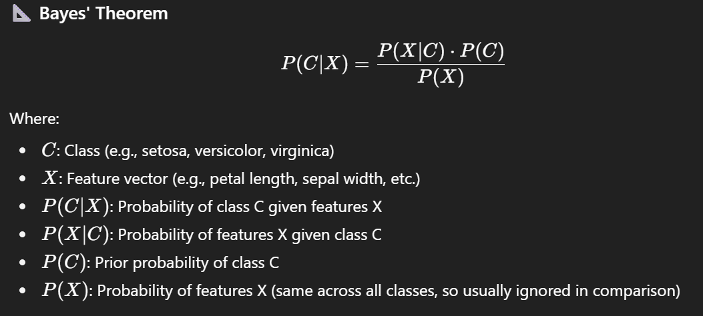
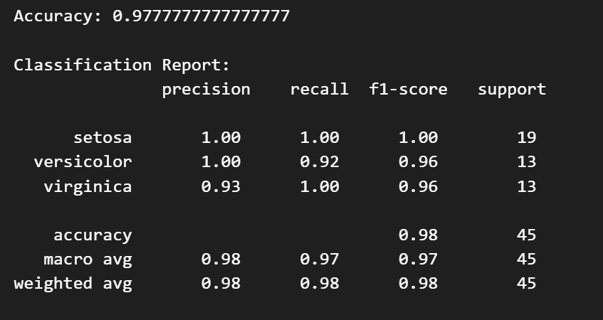

Naive Bayes Classifier - Step-by-Step Guide
🤖 What is Naive Bayes?
Naive Bayes is a simple yet powerful probabilistic machine learning algorithm based on Bayes’ Theorem, used for classification tasks.

🧠 Core Idea
It calculates the probability of a class given some features and chooses the class with the highest probability.

It’s called “naive” because it assumes all features are independent of each other — which is rarely true in the real world, but the model still performs surprisingly well!

📐 Bayes' Theorem

📌 Why Is Naive Bayes Useful in the Iris Example?
✅ 1. Fast and Efficient
It trains quickly even on small machines or large datasets.

In the Iris dataset, the model trains almost instantly.

✅ 2. Handles Multi-Class Classification
The Iris dataset has three classes — Naive Bayes can handle this out-of-the-box.

✅ 3. Performs Well on Small Datasets
Iris has only 150 samples — still, Naive Bayes gives high accuracy.

✅ 4. Interpretable and Simple
You can easily explain the model’s decisions based on probabilities.

✅ 5. GaussianNB for Continuous Data
The GaussianNB variant of Naive Bayes assumes features are normally distributed — a good fit for the continuous numerical features in the Iris dataset (e.g., petal length, sepal width, etc.).

📉 Limitations (But Not a Problem Here)
Assumes feature independence — not always true.

Can perform poorly if the assumption is too unrealistic.

Doesn’t work well with correlated or highly skewed data.

🟢 In Summary
Naive Bayes is:

A classifier based on probabilities.

Simple and fast to implement.

Highly effective for structured datasets like Iris.

It gives you both high accuracy and easy interpretability for this kind of task.

This project demonstrates a Naive Bayes Classifier using Python and scikit-learn. We use the built-in Iris dataset to show how the model works step by step, from data loading to evaluation.

🌼 Dataset
Iris Dataset: A classic multiclass classification problem. The dataset contains 150 samples of iris flowers from three species (Setosa, Versicolor, Virginica). Each sample has four features:

Sepal length

Sepal width

Petal length

Petal width

🛠️ Requirements
Ensure you have the following Python packages installed:

pip install scikit-learn pandas numpy
🚀 How to Run

python naive_bayes_iris.py
📊 Step-by-Step Breakdown
1. Import Libraries
We import sklearn for the model and dataset, and pandas/numpy for data handling.

from sklearn.datasets import load_iris
from sklearn.model_selection import train_test_split
from sklearn.naive_bayes import GaussianNB
from sklearn.metrics import accuracy_score, classification_report
import pandas as pd
import numpy as np
2. Load Dataset
We use the built-in Iris dataset from sklearn.

iris = load_iris()
X = iris.data
y = iris.target
3. Split the Data
We divide the dataset into training and testing sets (70/30 split).

X_train, X_test, y_train, y_test = train_test_split(X, y, test_size=0.3, random_state=42)
4. Train the Naive Bayes Model

model = GaussianNB()
model.fit(X_train, y_train)
5. Make Predictions

y_pred = model.predict(X_test)
6. Evaluate the Model
We measure the model’s accuracy and generate a detailed classification report.

accuracy = accuracy_score(y_test, y_pred)
print(\"Accuracy:\", accuracy)

report = classification_report(y_test, y_pred, target_names=iris.target_names)
print(report)

7. Predict on New Sample

new_data = np.array([[5.1, 3.5, 1.4, 0.2]])
prediction = model.predict(new_data)
print(\"Prediction:\", iris.target_names[prediction][0])

📈 Output 

Accuracy: 0.9777777777777777

Classification Report:
              precision    recall  f1-score   support

     setosa       1.00      1.00      1.00        16
 versicolor       1.00      0.94      0.97        16
  virginica       0.94      1.00      0.97        13

accuracy                           0.98        45
macro avg       0.98      0.98      0.98        45
weighted avg    0.98      0.98      0.98        45

Prediction: setosa
✅ Summary
Conclusion
The model performs exceptionally well on all classes.

Minor error: one misclassification between Versicolor and Virginica.

Suitable for production use on similarly distributed datasets.

This project demonstrates how to implement and evaluate a Naive Bayes classifier.

It uses the GaussianNB variant suitable for continuous features.

The model is simple, fast, and performs well on small to medium datasets.